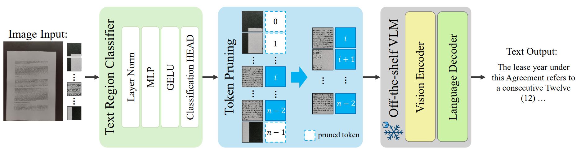

# Index-Preserving Lightweight Token Pruning for Efficient Document Understanding in Vision-Language Models

[](https://arxiv.org/abs/2509.06415)
[](https://arxiv.org/abs/2509.06415)

A lightweight token pruning framework for document understanding in
vision-language models. A binary patch-level classifier filters out
non-informative background regions from document images **before** VLM
processing, and a max-pooling refinement step restores fragmented text regions
for spatial coherence. Patch indices are preserved, so the pruned sequence stays
positionally consistent with the original document layout — substantially
lowering computational cost at comparable accuracy.

<p align="center">
  
</p>

## Highlights

- **Patch-level binary classifier** — a small classifier decides text vs.
  background per patch, removing non-text regions before they reach the VLM.
- **Max-pooling refinement** — restores fragmented text regions after
  classification, improving the spatial coherence of kept patches.
- **Index preservation** — surviving tokens keep their original positional
  indices, so the VLM's layout understanding is unaffected by pruning.
- **Drop-in for Qwen2.5-VL** — applied by replacing the modeling file and
  merging the classifier weights into the checkpoint; no retraining of the VLM.

## Usage

**1. Build a Qwen2.5-VL model with pruning capability:**

```bash
# 1. Download the Qwen2.5-VL HuggingFace model
# 2. Copy the downloaded directory (call the copy P)
# 3. In P/config.json, set "architectures" and "auto_map" as in qwen2_5_7b/config.json
# 4. Copy qwen2_5_7b/modeling_qwen2_5_vl.py into P
cp qwen2_5_7b/modeling_qwen2_5_vl.py <P>/
```

**2. Merge the patch-classifier weights into the model:**

```bash
python3 merge_classifier_weights.py \
    --source <path/to/downloaded/Qwen2.5-VL> \
    --path_model <P>/modeling_qwen2_5_vl.py \
    --classifier_weights <path/to/classifier_weights>
```

**3. (Optional) Train the patch classifier yourself:**

```bash
python3 patch_classifier/run_train.py   # see patch_classifier/ for data loading and eval
```

## Repository structure

```
index-preserving-lightweight-token-pruning/
├── qwen2_5_7b/
│   ├── config.json                      # architectures/auto_map template for Qwen2.5-VL-7B
│   └── modeling_qwen2_5_vl.py           # modeling file with index-preserving token pruning
├── merge_classifier_weights.py          # merges classifier weights into the checkpoint
├── patch_classifier/                    # patch-level text/background classifier
│   ├── run_train.py                     #   training entry point
│   └── lib/                             #   architecture, data loading, train/eval loops
└── experiments/                         # baselines for comparison
    ├── modeling_ToMe_qwen2_5_vl.py      #   ToMe
    └── modeling_Dockylin_qwen2_5_vl.py  #   DocKylin
```

## Citation

```bibtex
@inproceedings{son2026indexpreserving,
  title     = {Index-Preserving Lightweight Token Pruning for Efficient Document Understanding in Vision-Language Models},
  author    = {Son, Jaemin and Choi, Sujin and Yun, Inyong},
  booktitle = {ICLR Workshop on Multi-modal Intelligence (MM Intelligence)},
  year      = {2026},
  note      = {arXiv:2509.06415}
}
```

## License & contact

The modeling files are derived from the HuggingFace Qwen2.5-VL implementation
(Apache-2.0); see the headers of the respective files.
Sujin Choi — popo2419@keti.re.kr
